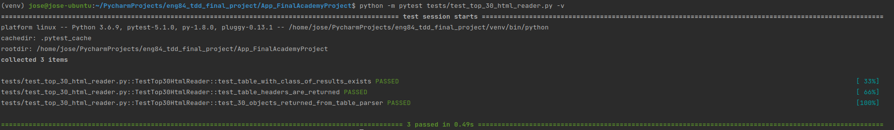

# IT Jobs Watch Data

## Introduction
The aim of this project is to create a simple service that can scrape useful data from ITJobswatch.

## Current Scope
At present the app is set up to be cloned and used to simply scrape the below services:

1. Home page top 30 job/roles / skills which can be found [here]()

The aim will be to expand this to further services such as:

* Regular polling of pages and writing to a database for longer terms stats
* Bespoke calls for specific job role data

And much more.

## Usage
_Pre-Requisites_
* Pycharm IDE
* Python 3.x + installed

### Installing packages
The necessary packages needed to run this program should automatically be picked up by pycharm. You may find a a few pop ups within the IDE that state there are dependencies missing, if you simply install these through the IDE you should be set up correctly.  

### Running tests

To test whether the program will work from your machine:
 
 * Ensure the `config.ini` file has the test environment set to `live`
 * Click the `Terminal` icon which can be found on the menu in the bottom left of Pycharm.
* Ensure you're in the root path of the project and type `python -m pytest tests/`

This should execute the tests if any fail you may have issues with this program.

### Running and using the program
To use the program simply right click on the `main.py` file and then click `Run 'main'`. This will run the command line user interface.

Follow the instructions to download via the various options given.

# Next steps
* Adding a job details search option (essentially be able to search for a specific role and return the details in a CSV)
* create a connected database for full deployment
* Build a scheduler as part of a full deployment to poll and add to the database 

# Testing App - Test Driven Development

__Team members:__

- Arun - Scrum Master and tester
- Jordan - Tester
- Jose - Tester

Test-driven development (TDD) is a software development process relying on software requirements being converted to test cases before software is fully developed. In simple terms, test cases for each functionality are created and tested first and if the test fails then the new code is written in order to pass the test and making code simple and bug-free.

__TDD process:__

- TDD cycle start with everything failing - RED
- Write code to pass the test - GREEN
- Refactor the code for the next test - BLUE
- This continues until all the test have successfully passed.

We proceed to correct the errors step by step:

## Step 1: Clone repository and add new interpreter

After installing the pre-requisites defined above, we proceed to open the `Pycharm` interpreter and create our Virtualenv Environment for the project.

Let's clone the repository in this environment and save folders with all the code that we are going to use.

## Step 2: Try to run the application

- Before running the app, make sure you are in the root directory of the project.

- After that, open the terminal in pycharm and run the following command to launch the app: `python main.py`.

- It should install the plugins (requirement.txt).

- If the app does not running, we need to install the requirements:

`pip install -r requirements.txt`

In this situation we have two scenarios:

1. Linux: everything was installed correctly.

2. Windows: we need to update the pluggy dependency in the `requirements.txt` file: `pluggy==0.13.1`. After that re-run the requirements.

- After installing the requirements, let's run the app again and it is going to work properly.

## Step 3: Set environment for testing

- Open `config.ini` file and set test environment `test_env` to `test`. With this, what we are going to do is fixing all the errors when the application is running on our machine, not on live. Save the file.

- Open the terminal and run `python -m pytest tests/ -v` to run the tests. We will use the module pytest which is a library available in python. `Pytest` is a framework that makes building simple and scalable tests easy. Tests are expressive and readable.

## Step 4: Start fixing the tests

- After running the tests we have seen that absolutely all of them have failed as expected.

- We are going to start to fix the errors, but for this we have three different `.py` files that are checking that everything works correctly in different parts of the code. The three files are:

1. `test_csv_generator.py`

2. `test_html_object_manager.py`

3. `test_top_30_html_reader.py`

__Let's start with test_top_30_html_reader:__

- If we run: `python -m pytest tests/test_top_30_html_reader.py -v`, we get the following output:

As we can see all the tests have passed correctly in the `test` environment. So we refactor and go to the next test.

__Now testing test_csv_generator:__

- If we run: `python -m pytest tests/test_csv_generator.py -v`, we get the following output:

As we can see, the test has failed, so we proceed to correct the code errors so that the test passes satisfactorily.

The problem is when the program open the resulting cvs, there is an extra blank line after each record, so we need to open the `outfile` with addtional paramenter. For that we are going to modify this code in the `top_30_csv_generator.py`. It looks like:

- Once the errors are corrected, we will see if the tests pass, `python -m pytest tests/test_csv_generator.py -v`:

Fantastic, all the tests have passed satisfactorily. We proceed to refactor and solve the following test.

__Finally, testing test_html_object_manager:__

- If we run: `python -m pytest tests/test_html_object_manager.py -v`, we get the following output:

As we can see, the test has failed, so we proceed to correct the code errors so that the test passes satisfactorily.

As we can see there are inconsistent namings convetion in files. So we proceed to open the `test_html_object_manager.py`, and ensure to change the class and variables(object) with the name from `HtmlObjectManager` to `HttpManager`. It looks like:

- Once the errors are corrected, we will see if the tests pass, `python -m pytest tests/test_html_object_manager.py -v`:

Fantastic, all the tests have passed satisfactorily.

Amazing, all the bugs related to the test environment have been corrected correctly. Let's check it out, `python -m pytest tests/ -v`:

All test are successfully in test environment.

## Step 5: Set environment for testing on live

- Open `config.ini` file and set test environment `test_env` to `live`. With this, what we are going to do is fixing all the errors when the application is running on live. We need it set to live so we can do the TDD and get it working for the live data because we got it working with the test data, but now we need make sure that is available for the clients.

- Open the terminal and run `python -m pytest tests/ -v` to run the tests on live environment.

## Step 6: Start fixing the tests on live environment.

- We are going to start to fix the errors, but for this we have three different `.py` files that are checking that everything works correctly in different parts of the code. These three files are the same that we have used previously in the environment test. The three files are:

1. `test_csv_generator.py`

2. `test_html_object_manager.py`

3. `test_top_30_html_reader.py`

- Open the terminal and run `python -m pytest tests/ -v` to run the tests on live environment. We get the following output:

As we can see we have 4 tests that have passed and 6 that have failed. Therefore we proceed to correct the tests one by one.
